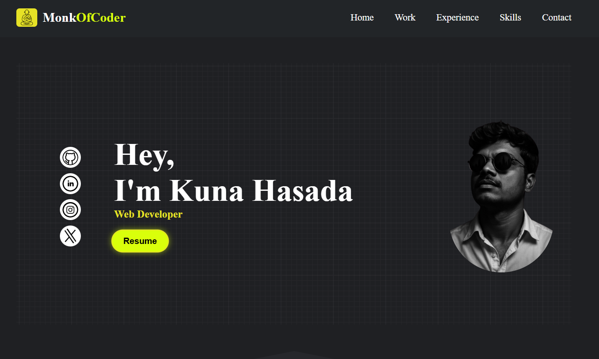
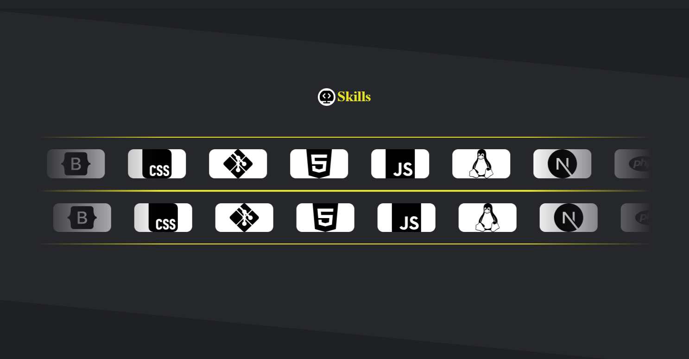
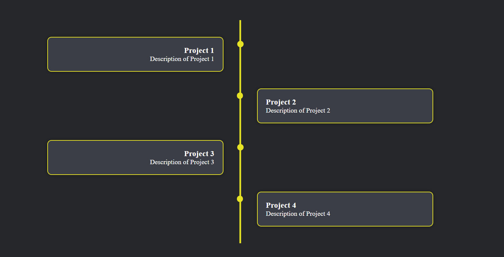
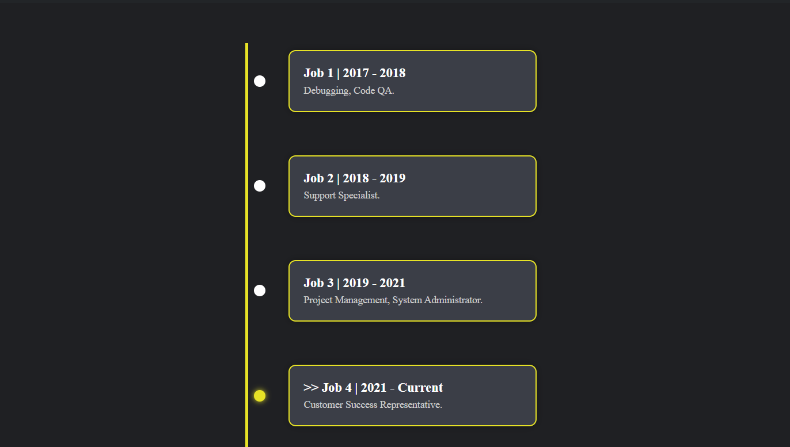
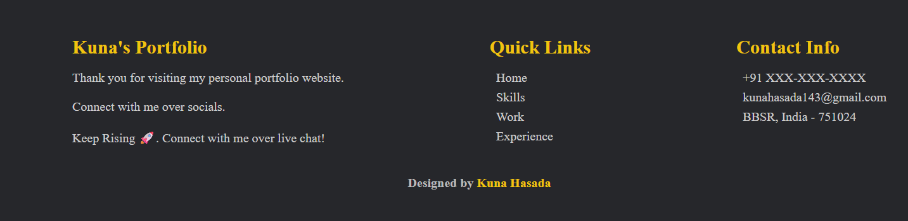

# 💼 Personal Portfolio Website

Welcome to my personal portfolio website! This site showcases my skills, projects, and contact information as a web developer.

---

## 📸 Screenshot

## 📖 Description

This is a responsive portfolio website built to showcase my:

- Skills (HTML, CSS, JavaScript, etc.)
- Personal projects
- Contact form (via EmailJS)
- Modern design with interactive UI

It’s fully optimized for both desktop and mobile devices.

---

## 🚀 Tech Stack

- **Frontend**: HTML5, CSS3, JavaScript  
- **Libraries/Tools**: Font Awesome, EmailJS, GitHub Pages  
- **Design**: Responsive layout, animations, custom icons

---

